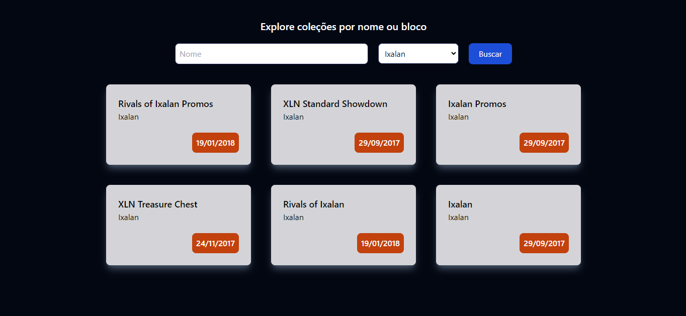

# Automatic Magic: The Gathering card pack opener

This project consists of creating an automated flow for opening Magic: The Gathering card packs from a specific collection.




## Table of contents

- [Automatic Magic: The Gathering card pack opener](#automatic-magic-the-gathering-card-pack-opener)
  - [Table of contents](#table-of-contents)
  - [Features](#features)
  - [Requirements](#requirements)
  - [Installation](#installation)
  - [Usage](#usage)
    - [Starting the Development Server](#starting-the-development-server)
    - [Building for Production](#building-for-production)
  - [License](#license)

## Features

- Filter collections by name and block.
- Open card packs from a specific collection.

## Requirements

- [Node.js](https://nodejs.org/en/) >= 20.10.0
- [npm](https://pnpm.js.org/) >= 10.4.0

## Installation

Set up the project using npm. Use the command
`npm install`

After completing the installation, the environment is ready for development.

## Usage

This section covers how to start the development server and build the project for production.

### Starting the Development Server

To start the development server with hot-reload, run the following command. The server will be accessible at [http://localhost:4200](http://localhost:4200):

```bash
ng serve
```

Note that in the '/' route there will be nothing shown on the screen, it is necessary to include an offer code in the url.
Use code "1" to view the offer page and form. Example: `http://localhost/1`

### Building for Production

To build the project for production, use:

```bash
ng build
```

Once the build process is completed, the application will be ready for deployment in a production environment. The build artifacts will be stored in the `dist/` directory.

## License

[MIT](http://opensource.org/licenses/MIT)

